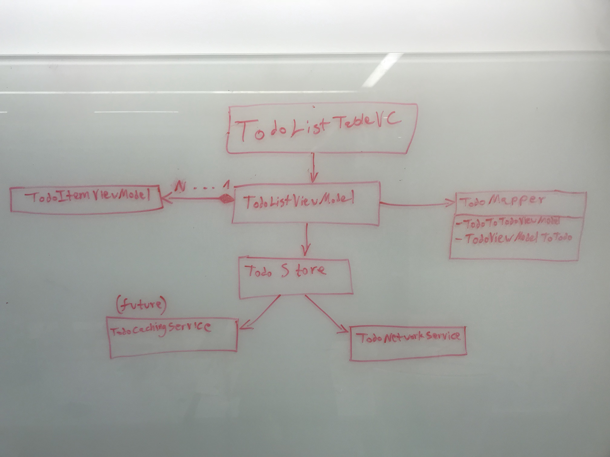

# Autodesk Test - Ofir Ben Tzur

Here's a short discussion about the project:

## Requirements, Assumptions & Solution Approach

I had to design and implement a todo list app using Swift for iOS, keeping scalability and design best-practices in mind, so I chose to go with the MVVM architecture, rather than the old plain MVC ("Massive View Controller").

The main layers (and some class representatives) of the app are:
  * View: TodoListTableVC, TodoCell
  * ViewModel: TodoListViewModel, TodoItemViewModel
  * Model: Todo(.swift)
  * Store: TodoStore, TodoNetworkService

The glue between all the layers is *ReactiveSwift* - it binds the view model's properties to the UI elements (ViewModel->View communication), it provide *promises* for the ViewModel layer when it need to interact with the *Store* layer, and much more.

Let's take 1 flow for example:
### the *getAllTodos* flow

The first ViewController that will be run the app is the *TodoListTableVC* ViewController.
In that ViewController I instantiated the ViewModel that corresponds to that ViewController - *TodoListViewModel*.
This ViewModel is in charge of handling the list of todos and to react to the user interactions (add/edit/delete todos).

*TodoListViewModel* also holds an array of *TodoItemViewModel*, which is empty, until we'll populate it - this array backs up the main todos table.

When the app is launched, the *TodoListTableVC.viewDidLoad()* method is called.
In that method, I observe the *todoViewModels* array so for every change, *tableView.reloadData()* is called, causing the table to show the todo items according to the updated backing array.

After that binding has been done, I'm calling *todoListViewModel.getAllTodos()*, which in turn call to *todoStore.getAll()*.
*todoStore.getAll()* returns a *SignalProducer* - a *ReactiveSwift* object we can observe in the ViewModel layer for success/failure.
When the response from the network returned, I map the response from array of *Todo* to array of *TodoViewModel* and set that as the array that backs up the todo table.

Thanks to the observer that is set on the backing array, *tableView.reloadData()* will be called and the table will be populated with the new todo array we got from the server.

The rest of the flows (create, edit, delete) are similar, sort of.

It's hard to explain the flow of an app that is based on promises and callbacks.
Anyway, here's a small diagram of the main classes of the app:

## 3rd party libraries

  * 'ReactiveCocoa', '~> 7.1'
  * 'ReactiveSwift', '~> 3.1'
  * 'Alamofire', '~> 4.6'
  * 'SwiftyJSON', '~> 4.0'

## Improvements

  * Cache mechanism - a cache mechanism can be relatively easy implemented in the project due to the "Store" abstraction layer between the view models and the networking layer.
  In that junction - the Store layer, one can decide if the cached data is fresh enough and return a *SignalProducer* with the cached value, or fetch the data from the network, like it is done now.
  * Use dependency injection library - currently I used Swift's default parameters values to inject the wanted implementation.
  For example, here's the *TodoListViewModel*'s constructor:
  > init(todoStore: TodoStore = TodoStoreImpl(), todoMapper: TodoMapper = TodoMapperImpl()) {...}

  * Use a mapping library instead of the *TodoMapper* I implemented. That should be easy as well, since I have a protocol and an implementation to the mapper I created.
  * The *Model* layer should be enhanced and should contain additional models for the todo items - the network layer should have its own models, the future cache layer should have its own models and so on. Currently I used only 1 model - *Todo*.
  * Handle errors - I have some of the infrastructure for handling errors - for example, the *Store* layer has its own error enum (*StoreError*) which is mapped from the network layer's errors, but still, I didn't cover all the possible errors in the app.
  * Write tests
